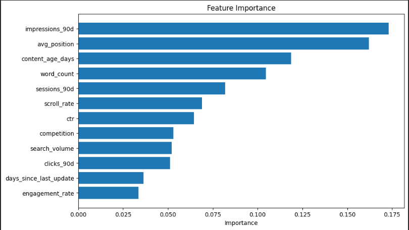
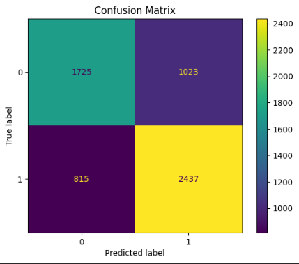

# Google Search Ranking & Discoverability Capstone

## Refresh / Content Opportunity Scoring

**Author:** Arooj Saleem

---

# Abstract

This project focuses on identifying website pages that require content refresh using anonymized FlyRank search performance data. A rule-based baseline scoring system was developed using visibility, freshness, content depth, and search position signals. A Random Forest classifier was then trained to predict declining content and prioritize refresh opportunities. The model achieved an accuracy of **69.37%** with an F1-score of **72.62%**. The final output is a ranked list of content recommendations that can support data-driven content maintenance.

---

# Introduction

Search performance changes over time because content becomes outdated, user interests change, and search competition increases. Refreshing the right content at the right time can improve visibility, clicks, and engagement.

The objective of this project is to identify pages that should be refreshed by analyzing search performance metrics and building both a baseline scoring system and a machine learning model.

---

# Data

## Dataset

This project uses the **FlyRank Machine Learning Internship Dataset**, which contains anonymized search performance and content metrics collected from real websites.

The dataset includes **30,000 content pages** and contains information related to search visibility, engagement, content freshness, and content characteristics.

### Main Features

- Search Volume
- Competition
- Content Type
- Word Count
- Impressions
- Clicks
- Sessions
- Click-Through Rate (CTR)
- Average Position
- Engagement Rate
- Scroll Rate
- Content Age
- Days Since Last Update
- Trend Direction

To protect privacy, no client names, URLs, or sensitive business information are included in the dataset.

# Methodology

The project followed a structured machine learning workflow:

1. Data loading and exploration.
2. Data preprocessing and feature engineering.
3. Exploratory Data Analysis (EDA).
4. Development of a rule-based baseline refresh scoring system.
5. Training a Random Forest classifier to predict declining content.
6. Evaluation using Accuracy, Precision, Recall, F1-score, and a Confusion Matrix.
7. Generation of ranked content refresh recommendations.

The baseline scoring system served as a reference, while the machine learning model was used to learn patterns from historical search performance data.

# Results

The Random Forest classifier was evaluated on the test dataset using standard classification metrics.

| Metric | Value |
|--------|--------|
| Accuracy | 69.37% |
| Precision | 70.43% |
| Recall | 74.94% |
| F1-Score | 72.62% |

The model achieved balanced performance in identifying both declining and non-declining pages. The F1-score of **72.62%** indicates that the model provides reliable predictions for prioritizing pages that may require content refresh.

## Feature Importance

The feature importance analysis shows which variables contributed the most to the model's predictions.

The most influential features were:

- Impressions (90 days)
- Average Position
- Content Age
- Word Count

These results suggest that search visibility, ranking position, and content freshness are the strongest indicators of pages that may benefit from a content refresh.

## Confusion Matrix

The confusion matrix summarizes the classification performance of the Random Forest model.

The model correctly classified most declining and non-declining pages while maintaining a good balance between precision and recall. Although some misclassifications occurred, the overall performance demonstrates that the model can effectively identify pages that are likely to decline.

## Baseline vs Machine Learning

| Method | Description |
|---------|-------------|
| Rule-based Baseline | Uses manually designed refresh scores based on visibility, freshness, ranking position, and content depth. |
| Random Forest | Learns patterns automatically from historical search performance data to predict declining content. |

The baseline approach relies on predefined business rules, whereas the Random Forest model learns complex relationships directly from the data. As a result, the machine learning approach provides a more flexible and scalable solution for identifying content refresh opportunities.

# Ranked Recommendations

The trained model generated a ranked list of pages based on their predicted probability of decline.

High-priority pages should be reviewed first for content updates, keyword optimization, metadata improvements, and content expansion. Lower-priority pages can be monitored and refreshed periodically based on future performance trends.

The recommendation system combines machine learning predictions with baseline business rules to support informed content optimization decisions.

# Limitations

- The dataset is anonymized and does not include page URLs or content text.
- The target variable was derived from trend direction rather than manually labeled data.
- Only structured features were used.
- The project evaluates a single machine learning model.

# Conclusion

This project demonstrates how machine learning can support content refresh prioritization using search performance data.

A rule-based baseline and a Random Forest classifier were developed to identify pages likely to decline in performance.

The results indicate that search visibility, ranking position, and content freshness are valuable indicators for prioritizing content updates.

The proposed approach provides a practical and scalable framework for supporting data-driven content maintenance decisions.

# Acknowledgments

Built on the **FlyRank Machine Learning Internship Dataset**.

Data Credit: https://flyrank.ai

This project was completed as part of the FlyRank Machine Learning Internship.

# References

1. FlyRank Machine Learning Internship Dataset
   https://flyrank.ai

2. Scikit-learn Documentation
   https://scikit-learn.org
